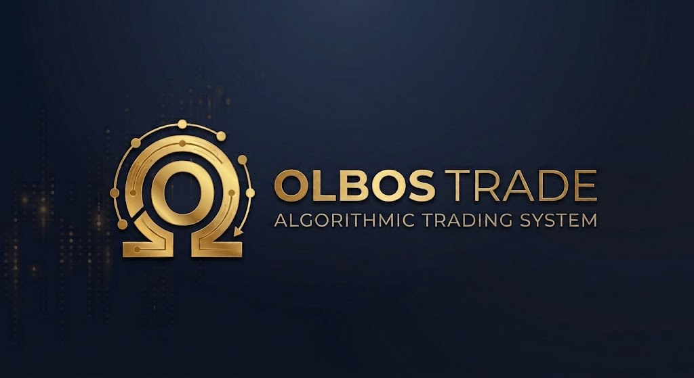

<p align="center">
  
</p>

# OlbosTrade
> *From Ancient Greek ὄλβος (olbos) — blessed prosperity through disciplined, rules-based quantitative trading.*

> **Philosophy: Capital preservation first. Remove emotion. Rules are law.**

A full-stack algorithmic options trading platform with IBKR integration, AI signal scoring (XGBoost regressor), execution modes (Manual / Copilot / Autopilot), psychological guardrails, and a Bloomberg-style terminal UI.

---

## Architecture

```
olbostrade/
├── backend/              Python 3.9+ · FastAPI · PostgreSQL · ib_insync
│   ├── app/
│   │   ├── api/routes/   REST endpoints (market, paper_trade, trade_desk, …)
│   │   ├── broker/       IBKR client · broker interface · fill simulator
│   │   ├── models/       SQLAlchemy ORM models
│   │   └── services/     Signal scorer · backtester · risk · regime · optimizer
│   └── .env              Local config (copy from .env.example)
├── frontend/             React 18 · TypeScript · Vite · Bloomberg terminal UI
│   └── src/
│       ├── components/   TerminalLayout · BrokerStatus · PortfolioGreeks
│       └── pages/        Dashboard · TradeDesk · Backtest · Journal · …
├── ml/                   XGBoost signal scorer training pipeline
│   ├── features.py       15-feature engineering (point-in-time, no look-ahead)
│   ├── train_signal_scorer.py   XGBRegressor on continuous return-on-risk
│   └── model_registry/   Trained model pkl (created after first training run)
├── start.sh              One-command startup script
├── stop.sh               Shutdown script
├── health.sh             System health check
└── logs/                 backend.log · frontend.log (created at runtime)
```

---

## Requirements

| Component | Requirement |
|-----------|-------------|
| Python | 3.9 or higher |
| Node.js | 18 or higher |
| IB Gateway | Paper trading, port 4002 |
| PostgreSQL | 14+ (optional — only for journal/trade persistence) |

---

## Daily Startup (Before Market Open)

**This is the correct procedure every trading day:**

### Step 1 — Open IB Gateway
- Launch **IB Gateway** (not TWS)
- Log in with your paper trading credentials
- Confirm API is enabled: `Configure → API → Settings → Enable ActiveX and Socket Clients`
- Socket port must be **4002**
- Add `127.0.0.1` to trusted IP addresses

### Step 2 — Start OlbosTrade
```bash
cd ~/Projects/olbostrade
./start.sh
```

The script will:
1. Verify IB Gateway is reachable on port 4002
2. Kill any stale backend/frontend processes
3. Start the backend on port 8000
4. Start the frontend on port 3000
5. Run a health check and print system status

### Step 3 — Verify
```bash
./health.sh
```

Expected output:
```
━━━━━━━━━━━━━━━━━━━━━━━━━━━━━━━
  OlbosTrade Health Check
━━━━━━━━━━━━━━━━━━━━━━━━━━━━━━━
  Backend  ✅  running
  Broker   ✅  connected (PAPER)
  IB GW    ✅  connected (port 4002)
  SPY      📈  $741.75 (+0.54%)
  UI       ✅  http://localhost:3000
━━━━━━━━━━━━━━━━━━━━━━━━━━━━━━━
```

### Step 4 — Open the terminal
Go to **http://localhost:3000** and confirm:
- Ticker strip is scrolling with live prices
- Broker status shows PAPER / CONNECTED
- Execution mode is set to **Autopilot** (or your preferred mode)

### Step 5 — Shutdown after market close
```bash
./stop.sh
```

---

## First-Time Setup

### 1. Clone and install dependencies
```bash
git clone <repo-url> olbostrade
cd olbostrade

# Backend
cd backend
pip3 install -r requirements.txt

# Frontend
cd ../frontend
npm install
```

### 2. Configure environment
```bash
cd backend
cp .env.example .env   # if .env.example exists, otherwise create .env
```

Minimum `.env` for local paper trading:
```env
BROKER=ibkr
IBKR_HOST=127.0.0.1
IBKR_PORT=4002
IBKR_CLIENT_ID=2
IBKR_TRADING_MODE=paper

STARTING_CAPITAL=25000.0
SIGNAL_SCORE_THRESHOLD=0.65
MODEL_PATH=ml/model_registry/signal_scorer_v1.pkl
```

> **Important:** `IBKR_PORT=4002` is for IB Gateway (paper). Use `7497` only if running TWS instead.
> If you get "clientId already in use", increment `IBKR_CLIENT_ID` (try 2, 5, 20).

### 3. Database migrations (optional)
Only needed if you want persistent trade journal and history:
```bash
cd backend
alembic upgrade head
```

### 4. First startup
```bash
cd ~/Projects/olbostrade
chmod +x start.sh stop.sh health.sh
./start.sh
```

---

## Auto-Restart on macOS Login (Optional)

To have the backend restart automatically if it crashes, or start on login:

```bash
# Enable
launchctl load ~/Library/LaunchAgents/com.olbostrade.backend.plist

# Disable
launchctl unload ~/Library/LaunchAgents/com.olbostrade.backend.plist

# Check status
launchctl list | grep olbostrade
```

The plist file is at `~/Library/LaunchAgents/com.olbostrade.backend.plist` (created by `start.sh` on first run).

---

## Execution Modes

Select your mode in the UI under **Trade Desk → Trading Mode** or the top execution bar.

| Mode | Behaviour |
|------|-----------|
| **Manual** | Signals are shown but no orders are placed. You review and decide. |
| **Copilot** | Signals go into an approval queue. You approve/reject each one. |
| **Autopilot** | Signals that pass all guardrails are executed automatically. Recommended for paper trading. |

Mode is persisted across restarts. Start with **Autopilot on paper** to validate the system before going live.

---

## Strategies

| Strategy | Direction | IV Rank | DTE | Exit |
|----------|-----------|---------|-----|------|
| Bull Put Spread | Bullish/neutral | >30 | 30–45 | 50% profit / 21 DTE / 2x loss |
| Bear Call Spread | Bearish/neutral | >30 | 30–45 | 50% profit / 21 DTE / 2x loss |
| Iron Condor | Range-bound | >40 | 30–45 | 25% profit / 21 DTE / strike breach |
| Bull Call Debit Spread | Strong bullish | <30 | 21–30 | 75% profit / 10 DTE / 50% loss |

---

## Guardrails

| Limit | Value | Consequence |
|-------|-------|-------------|
| Daily loss | -2% | 24h cooling off |
| Weekly loss | -5% | 3-day pause |
| Monthly loss | -10% | 30-day suspension |
| Consecutive losses | 3 | 48h pause |
| Daily trade cap | 6 | No more trades today |
| Capital preservation | <85% NAV | Defense mode: credit spreads only, 50% size |

### Capital Preservation Mode
Triggers when portfolio drops below 85% of starting capital:
- Only Bull Put Spread and Bear Call Spread allowed
- Position size cut by 50%
- AI signal threshold raised: 12% RoR → 18% RoR minimum

### Pre-Trade Checklist
Every signal must pass ALL of these — no exceptions:
1. Guardrail check (all loss limits + cooling off periods)
2. Risk manager (Greeks limits + concentration)
3. AI signal score ≥ threshold (predicted RoR ≥ 12%)
4. No earnings within 5 days
5. Daily trade cap not reached
6. Max concurrent positions not reached

---

## ML Signal Scorer

The signal scorer is an **XGBoost regressor** that predicts **return-on-risk (RoR)** for each potential trade. A signal is approved only when predicted RoR ≥ 12%.

### Features (15 total)
| Feature | Description |
|---------|-------------|
| `iv_rank` | IV rank over 252-day lookback (point-in-time) |
| `iv_percentile` | IV percentile over 252-day lookback |
| `vix_level` | VIX closing level at entry |
| `spy_rsi_14` | SPY RSI(14) at entry |
| `spy_adx_14` | SPY ADX(14) — trend strength |
| `spy_trend_direction` | 1.0 if above SMA-20, -1.0 if below |
| `days_to_expiry` | DTE at entry |
| `short_strike_delta` | Short leg delta |
| `spread_width` | Width of spread in points |
| `credit_to_width_ratio` | Credit received / spread width |
| `earnings_days_away` | Days until next earnings (capped at 60) |
| `spy_realized_vol_20d` | 20-day realized vol (annualised) |
| `iv_minus_rv` | IV premium over realized vol |
| `credit_theta_rate` | Daily credit decay as % of max risk |
| `vix_term_slope` | VIX3M / VIX ratio (>1 = contango = normal) |

### Training
```bash
# 1. Run backtests via the UI or API
# POST /api/backtest/run  →  GET /api/backtest/{id}/results

# 2. Export results to JSON
# GET /api/backtest/{id}/export  →  save as backtest_results.json

# 3. Train the model
cd olbostrade   # project root
python3 ml/train_signal_scorer.py backtest_results.json

# Model saved to ml/model_registry/signal_scorer_v1.pkl
# Backend auto-loads on next restart
```

### Audit trail
The model is saved with a full audit dict:
- CV strategy: `TimeSeriesSplit(gap=45)` — no future data leaks into training folds
- Label: continuous RoR (not binary win/loss)
- Staleness check: backend logs a WARNING if model is >90 days old
- SHAP direction check: validates economic logic at train time and on each live signal

---

## Market Data

| Source | Used for |
|--------|----------|
| **yfinance** | All price display — ticker strip, snapshots, regime classification, equity scans. Free, no subscription. |
| **IBKR** | Order execution, account balance, positions, options chains. |

IBKR market data subscriptions are **not required** for the system to run. Prices come from yfinance (15-min delayed during market hours, last close outside hours).

---

## Regime Classification

The system classifies the market into four regimes every 30 minutes:

| Regime | VIX | ADX | Allowed |
|--------|-----|-----|---------|
| LOW_VOL_TRENDING | <15 | >25 | Equity momentum + Bull Call Debit |
| NORMAL_MEAN_REVERT | 15–25 | any | All strategies |
| HIGH_VOL_TRENDING | 25–35 | >20 | Bull Put + Bear Call only |
| CRISIS | >35 | any | No new trades |

---

## Pages

| Page | Key Features |
|------|-------------|
| Dashboard | Equity curve, Greeks bar, open positions, guardrail banner |
| Trade Desk | Execution mode bar, signal queue, approvals, P&L breakdown |
| Backtest | Strategy selector, date range, walk-forward metrics, trade log |
| Paper Trade | Live positions, portfolio value, signal queue |
| Risk Monitor | Greeks gauges, daily/weekly loss meters |
| Journal | Rule Breach P&L Impact, tag performance, mistake analysis |
| Research | Strategy comparison ranked by Sharpe |

---

## Kill Switch

An emergency stop is available at any time via the API or the UI. When engaged, **all order submission is halted immediately** — no signal can reach IBKR while the switch is on.

```bash
# Engage (stop all trading)
curl -X POST http://localhost:8000/api/trade-desk/kill-switch -H "Content-Type: application/json" -d '{"engaged": true}'

# Reset (resume trading)
curl -X POST http://localhost:8000/api/trade-desk/kill-switch -H "Content-Type: application/json" -d '{"engaged": false}'

# Check state
curl http://localhost:8000/api/trade-desk/kill-switch
```

The kill switch is checked:
1. Before guardrail evaluation (Autopilot)
2. After guardrail evaluation and before order submission
3. Inside `_execute_signal()` as the first action, even for Copilot approvals

---

## Order Execution Tuning

| Variable | Default | Description |
|----------|---------|-------------|
| `LIMIT_PRICE_AGGRESSION` | `1.0` | Credit spread limit price as fraction of mid. `1.0` = at mid (best fills). `0.90` = accept 10% less credit (more fills). |
| `FILL_TIMEOUT_SECONDS` | `60` | Seconds to wait for a fill before cancelling and retrying. |
| `RETRY_PRICE_STEP` | `0.05` | Dollar amount to lower limit price on each cancel-and-retry. |
| `MAX_ORDER_RETRIES` | `2` | Maximum cancel-and-retry cycles per order. |

### How fill retry works
1. Order submitted at `estimated_credit × LIMIT_PRICE_AGGRESSION`
2. If no fill after `FILL_TIMEOUT_SECONDS` → cancel, lower limit by `RETRY_PRICE_STEP`, resubmit
3. Repeat up to `MAX_ORDER_RETRIES` times
4. After all attempts exhausted → return `cancelled` status, log the failure

All status changes (Submitted → PartialFill → Filled / Cancelled) are logged in real time.

---

## Common Issues & Fixes

### Backend won't start — `TypeError: unsupported operand type(s) for |`
You are running Python 3.9 and a model file uses `X | None` union syntax.
All model files should use `Optional[X]` from `typing`. File: `backend/app/models/`.

### IBKR `Error 326: client id already in use`
Another session is holding that clientId. Try a different one:
```bash
# In backend/.env
IBKR_CLIENT_ID=5   # try 2, 5, 20, 50 until one works
```
Then restart: `./stop.sh && ./start.sh`

### Prices not showing in UI (`—` in ticker strip)
1. Check the backend is running: `./health.sh`
2. Check Vite proxy in `frontend/vite.config.ts` — target must be `http://localhost:8000`
3. If yfinance errors: `pip3 install --upgrade yfinance` (requires ≥1.2.0)

### Broker shows "not connected" but IB Gateway is open
- Confirm port: `Configure → API → Socket port` must be **4002** (Gateway) or **7497** (TWS)
- Confirm trusted IP: `127.0.0.1` must be in the allowed list
- Confirm `IBKR_PORT` in `backend/.env` matches what Gateway shows

### UI loads but API calls fail (network errors in browser console)
Vite proxy is misconfigured. In `frontend/vite.config.ts`:
```ts
target: "http://localhost:8000",   // must match backend port
```
Restart the frontend after any `vite.config.ts` change.

---

## Running Tests

```bash
cd backend
pip3 install -r requirements.txt
pytest tests/ -v
```

Test coverage:
- `test_guardrails.py` — guardrail edge cases
- `test_fill_simulator.py` — liquidity levels + commissions
- `test_options_pricer.py` — Black-Scholes within 0.01 tolerance
- `test_ibkr_client.py` — mocked ib_insync
- `test_position_reconciler.py` — position reconciliation
- `test_kill_switch.py` — emergency kill switch

---

## Environment Variables Reference

| Variable | Default | Description |
|----------|---------|-------------|
| `BROKER` | `ibkr` | Active broker: `ibkr` or `alpaca` |
| `IBKR_HOST` | `127.0.0.1` | IB Gateway / TWS host |
| `IBKR_PORT` | `4002` | `4002` = Gateway paper, `4001` = Gateway live, `7497` = TWS paper |
| `IBKR_CLIENT_ID` | `2` | Must be unique — increment if "already in use" error |
| `IBKR_TRADING_MODE` | `paper` | `paper` or `live` |
| `STARTING_CAPITAL` | `25000.0` | Paper portfolio starting value |
| `MAX_DAILY_LOSS_PCT` | `0.02` | 2% daily stop |
| `MAX_WEEKLY_LOSS_PCT` | `0.05` | 5% weekly stop |
| `MAX_MONTHLY_LOSS_PCT` | `0.10` | 10% monthly stop |
| `MAX_CONCURRENT_POSITIONS` | `5` | Max open positions at once |
| `MAX_TRADES_PER_DAY` | `6` | Daily trade cap |
| `LIVE_MIN_PAPER_TRADING_DAYS` | `90` | Paper-trading days required before live orders (live mode only) |
| `LIVE_MIN_PAPER_CLOSED_TRADES` | `20` | Finished trades required before live orders (live mode only) |
| `SIGNAL_SCORE_THRESHOLD` | `0.65` | Legacy classifier threshold (v1 model) |
| `MODEL_PATH` | `ml/model_registry/signal_scorer_v1.pkl` | Path to trained signal scorer |
| `SENDGRID_API_KEY` | `` | Optional — for email alerts |
| `ALERT_EMAIL` | `` | Optional — alert recipient |

---

## Port Reference

| Service | Port | Notes |
|---------|------|-------|
| Backend (FastAPI) | `8000` | `http://localhost:8000` |
| Frontend (Vite) | `3000` | `http://localhost:3000` |
| IB Gateway paper | `4002` | Must be open before starting |
| IB Gateway live | `4001` | Do not use until paper validated |
| TWS paper (alt) | `7497` | Only if using TWS instead of Gateway |

---

## Paper Trading Checklist Before Going Live

- [ ] Paper traded for at least 3 months
- [ ] CV AUC (or MAE) of signal scorer is stable across market regimes
- [ ] All guardrails triggered and recovered correctly at least once
- [ ] Drawdown never exceeded 8% during paper period
- [ ] Execution mode tested in all three modes (Manual, Copilot, Autopilot)
- [ ] SHAP direction check passes — no economically-backwards features
- [ ] Model retrained at least once on accumulated paper trade data

---

*Paper trade for 3 months minimum before any live capital.*
